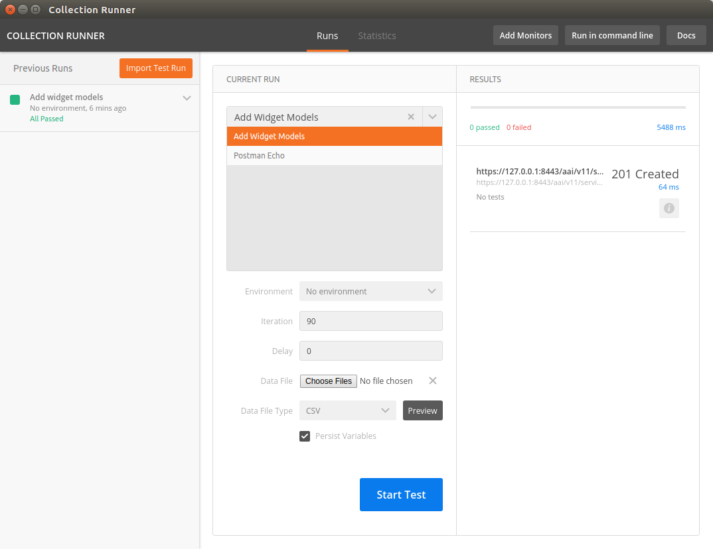
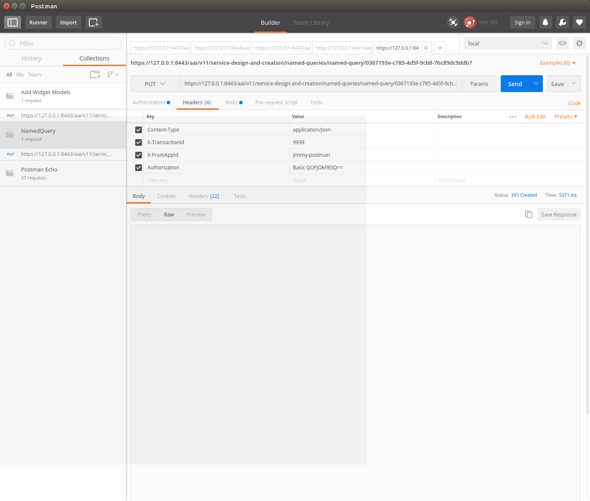
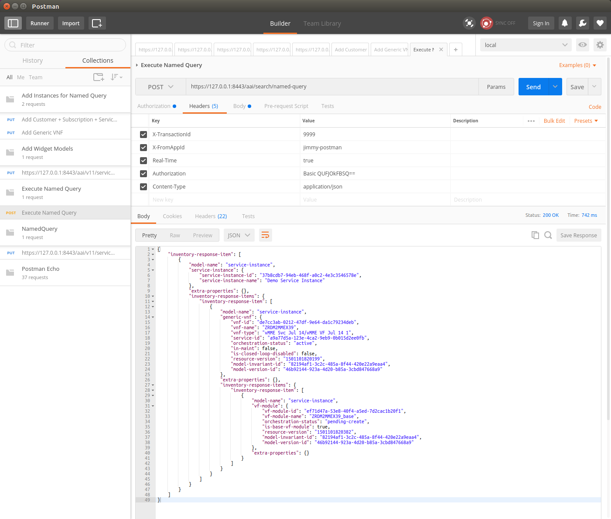

.. contents::
   :depth: 3
.. _dev-setup:

AAI Developer Environment Setup
================================

This guide will illustrate setting up an A&AI development environment in
Ubuntu 16.04.  

For this exercise, I set up a new instance of Ubuntu in Virtualbox and
gave it 16G RAM, 200GB dynamically allocated storage, and 3 processors.

Install openjdk 8
-----------------

   .. code:: bash

      sudo apt install openjdk-8-jdk

Install single node hadoop/titan
--------------------------------

   .. code-block:: bash

     wget http://s3.thinkaurelius.com/downloads/titan/titan-1.0.0-hadoop1.zip

     unzip titan-1.0.0-hadoop1.zip

     cd titan-1.0.0-hadoop1
     
     sudo ./bin/titan.sh start

Install haproxy
---------------

   .. code-block:: bash

     sudo apt-get -y install haproxy

     haproxy -v
       HA-Proxy version 1.6.3 2015/12/25
       Copyright 2000-2015 Willy Tarreau
        willy@haproxy.org http://haproxy.org/

- Install this haproxy.cfg file in /etc/haproxy

    `haproxy.cfg <https://wiki.onap.org/download/attachments/10782088/haproxy.cfg?version=2&modificationDate=1501018863000&api=v2>`__

  .. code-block:: bash

    sudo cp aai.pem /etc/ssl/private/aai.pem

    sudo chmod 640 /etc/ssl/private/aai.pem

    sudo chown root:ssl-cert /etc/ssl/private/aai.pem

  `aai.pem <https://wiki.onap.org/download/attachments/10782088/aai.pem?version=1&modificationDate=1501019585000&api=v2>`__

  .. code-block:: bash

    sudo mkdir /usr/local/etc/haproxy

- Add these hostnames to the loopback interface in /etc/hosts

   .. code-block:: bash

     127.0.0.1 localhost aai-traversal.api.simpledemo.openecomp.org aai-resouces.api.simpledemo.openecomp.org

- Restart haproxy

   .. code-block:: bash

     sudo service haproxy restart

Set up repos
------------

- First, follow the initial setup instructions in 
  `Setting Up Your Development Environment <https://wiki.onap.org/display/DW/Setting+Up+Your+Development+Environment>`__

  .. code-block:: bash

    mkdir -p ~/LF/AAI

    cd ~/LF/AAI

    git clone ssh://<username>@gerrit.onap.org:29418/aai/aai-common

    git clone ssh://<username>@gerrit.onap.org:29418/aai/traversal

    git clone ssh://<username>@gerrit.onap.org:29418/aai/resources

    git clone ssh://<username>@gerrit.onap.org:29418/aai/logging-service

- If you did not originally create a settings.xml file when setting
  up the dev environment, you may get an error on some of the repos
  saying that operant is unresolvable.  Using the example
  settings.xml file should solve this problem:
  `Setting Up Your Development Environment#MavenExamplesettings.xml <https://wiki.onap.org/display/DW/Setting+Up+Your+Development+Environment#SettingUpYourDevelopmentEnvironment-MavenExamplesettings.xml>`__

Build aai-common, traversal, and resources
------------------------------------------

   .. code-block:: bash
     
     cd ~/LF/AAI/aai-common

     mvn clean install # Should result in BUILD SUCCESS

     cd ~/LF/AAI/resources

     mvn clean install # Should result in BUILD SUCCESS

     cd ~/LF/AAI/logging-service

     mvn clean install # Should result in BUILD SUCCESS

     cd ~/LF/AAI/traversal

You might need to add the following to traversal/pom.xml to get traversal to build: 

       .. code-block:: xml

        <repositories><repository><id>maven-restlet</id><name>Restlet repository</name><url>https://maven.restlet.com</url></repository></repositories>

   .. code-block:: bash

     mvn clean install # Should result in BUILD SUCCESS

Titan setup
-----------

   1. Modify both titan-cached.properties and
        titan-realtime.properties to the following (for all MS’s that
        will connect to the local Cassandra backend)
      
	.. code-block:: bash

	  storage.backend=\ *cassandra*
	  storage.hostname=\ *localhost*

   2. update
      ~/LF/AAI/resources/aai-resources/bundleconfig-local/etc/appprops/titan-cached.properties

   3. update
      ~/LF/AAI/resources/aai-resources/bundleconfig-local/etc/appprops/titan-realtime.properties

   4. update
      ~/LF/AAI/traversal/aai-traversal/bundleconfig-local/etc/appprops/titan-cached.properties

   5. update
      ~/LF/AAI/traversal/aai-traversal/bundleconfig-local/etc/appprops/titan-realtime.properties

   6. The following property can be added to specify the keyspace
        name, each time you do this step (g) should be done. If not
        specified Titan will try to create/use a defaulted keyspace
        named titan.

	.. code-block:: bash

	  storage.cassandra.keyspace=<keyspace name>

   7. From the resources MS run the create db schema standalone program.

   8. ***NOTE***: The first thing that would need to be done is adding
      the schema to the local instance. (this will need to be done
      whenever using a new keyspace or after wiping the data).

    Runnable class org.onap.aai.dbgen.GenTester with the following vm
    args.

    .. code-block:: bash

      -DAJSC_HOME=~/LF/AAI/resources -DBUNDLECONFIG\_DIR="bundleconfig-local"

   9. Here's the command I used, and it worked:

      .. code-block:: bash

        cd ~/LF/AAI; java -DAJSC_HOME=/home/jimmy/LF/AAI/resources/aai-resources
        -DBUNDLECONFIG_DIR="bundleconfig-local" -cp
        aai-common/aai-core/target/aai-core-1.1.0-SNAPSHOT.jar:resources/aai-resources/target/aai-resources.jar:resources/aai-resources/target/userjars/\*
        org.onap.aai.dbgen.GenTester

Start the "resources" microservice
----------------------------------

   1. Resources runs on port 8446.  Go to the resources directory
   
      .. code-block:: bash

       $ cd ~/LF/AAI/resources

   2. Set the debug port to 9446

      .. code-block:: bash

          export MAVEN_OPTS="-Xms1024m -Xmx5120m -XX:PermSize=2024m
          -Xdebug -Xnoagent -Djava.compiler=NONE
          -Xrunjdwp:transport=dt_socket,address=9446,server=y,suspend=n"

   3. Start the microservice

      .. code-block::bash

        $ mvn -P runAjsc

Verify the resources microservice (this example uses Postman utility for Google Chrome)
^^^^^^^^^^^^^^^^^^^^^^^^^^^^^^^^^^^^^^^^^^^^^^^^^^^^^^^^^^^^^^^^^^^^^^^^^^^^^^^^^^^^^^^

   1.  Use basic auth, user = AAI, pw = AAI

   2.  Set the X-TransactionId header (in the example below, the value is
       9999)

   3.  Set the X-FromAppId header (in the example below, the value is
       jimmy-postman)

   4.  Perform a GET of https://127.0.0.1:8443/aai/v11/network/vces

   5.  You should see an error as below, 404 Not Found, ERR.5.4.6114. 
       This indicates that the service is functioning normally:

+------------------------------------------+
| |image1|                                 |
+------------------------------------------+

Start the "traversal" microservice
----------------------------------

   1. Traversal runs on port 8447.  Go to the traversal directory:

      .. code-block:: bash

       $ cd ~/LF/AAI/traversal
      
   2.  Set the debug port to 9447

       $ export MAVEN_OPTS="-Xms1024m -Xmx5120m -XX:PermSize=2024m
        -Xdebug -Xnoagent -Djava.compiler=NONE
        -Xrunjdwp:transport=dt_socket,address=9447,server=y,suspend=n"

   3.  Start the microservice

      .. code-block:: bash

       $ mvn -P runAjsc

      You should see something like this:

      .. code-block:: bash

       2017-07-26
       12:46:35.524:INFO:oejs.Server:com.att.ajsc.runner.Runner.main():
       Started @25827ms

Verify the traversal microservice
^^^^^^^^^^^^^^^^^^^^^^^^^^^^^^^^^

   1.  Set up the widget models
       This will set up the postman to add widget models: `Add Widget Models.postman_collection.json <https://wiki.onap.org/download/attachments/10782088/Add%20Widget%20Models.postman_collection.json?version=2&modificationDate=1501102559000&api=v2>`__ `NamedQuery.postman_collection.json <https://wiki.onap.org/download/attachments/10782088/NamedQuery.postman_collection.json?version=2&modificationDate=1501102582000&api=v2>`__

   2.  Create a runner using this file:
       `models.csv <https://wiki.onap.org/download/attachments/10782088/models.csv?version=1&modificationDate=1501100140000&api=v2>`__

   3.  Run the test runner
       |image2|

   4.  Add a named query called "getComponentList" (this named query is used by VID):

       `NamedQuery.postman_collection.json <ificationDate=1501102582000&api=v2>`__
       
       |image3|

   5.  Add objects:

       `Add Instances for Named Query.postman_collection.json <https://wiki.onap.org/download/attachments/10782088/Add%20Instances%20for%20Named%20Query.postman_collection.json?version=1&modificationDate=1501102617000&api=v2>`__ 

   6.  Execute named-query:
       `Execute Named Query.postman_collection.json <https://wiki.onap.org/download/attachments/10782088/Execute%20Named%20Query.postman_collection.json?version=1&modificationDate=1501102658000&api=v2>`__
       You should see something like the following:
       |image4|

- Your A&AI instance is now running, both the resources and traversal microservices are working properly with a local titan graph.

- Next: `Tutorial: Making and Testing a Schema Change in A&AI <https://wiki.onap.org/pages/viewpage.action?pageId=10783023>`__

.. |image1| image:: media/image1.png
   :width: 4.87500in
   :height: 2.87500in

