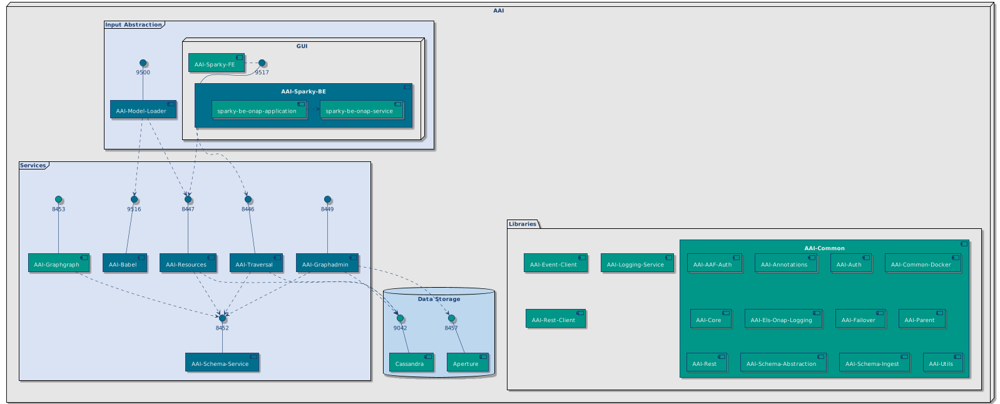

.. This work is licensed under a Creative Commons Attribution 4.0 International License.
.. _architecture:

Architecture
------------

AAI Architecture in ONAP
^^^^^^^^^^^^^^^^^^^^^^^^

AAI provides ONAP with its logically centralized view of inventory data, taking in updates from orchestrators, controllers, and assurance systems.  With that responsibility, it takes on a key data management role, providing the ONAP components not only the current "as-built" view of the services, but also the view into the data of the system itself; it's integrity, it's chronology, and where the source of the information can be found.

In addition to inventory and topology management, AAI provides the ability to do inventory administration.  Data in AAI is continually updated in real-time as changes are made within the cloud. Because AAI is metadata-driven, new resources and services can be added quickly with Service Design and Creation (SDC) catalog definitions, using the AAI model loader, thus eliminating the need for lengthy development cycles. In addition, new inventory item types can be added quickly through schema configuration files.

.. image:: images/aai-architecture.PNG

AAI's Role in ONAP
^^^^^^^^^^^^^^^^^^

AAI is where the data converges, where the pictures come together, and where the ONAP actor systems ask questions so they can make their decisions.  As new network or data center resources become available, AAI is updated with their specifics via REST APIs.  When new service types are designed, or new services instantiated, systems keep AAI up to date of their deployment at each step of the way.  As telemetry is gathered for the services as well as their underlying infrastructure, the health and analytics conclusions reached are stored in AAI as state information.  When assurance systems detect a failure, AAI is queried to determine the extent of the impact.

With the high volume and variety of data, AAI must be prepared to answer many types of queries; real-time search to quickly retrieve specific items from an ocean of data, relationships to determine impacts and consequences, aggregations and counts to explore availability and consumption, validation and integrity to establish whether systems are acting on good information, history and provenance to reconstruct the current view and its context, and enrichment out to legacy systems to examine the low-level details of the network and virtual assets.

.. image:: images/aai_in_onap.png

AAI Components
^^^^^^^^^^^^^^

Input abstraction
"""""""""""""""""
Applications that serve as entry points to A&AI.

====================  ===
**aai/model-loader**  Obtains SDC artifacts and loads them into the A&AI Resources service for storage.
**aai/sparky-be**     AAI user interface back end.
**aai/sparky-fe**     AAI user interface front end.
====================  ===

Services
"""""""""""""""
The core microservices that facilitate management of AAI objects.

======================  ===
**aai/babel**           AAI Microservice to generate AAI model XML from SDC TOSCA CSAR artifacts.
**aai/resources**       AAI Resources Micro Service providing CRUD REST APIs for inventory resources. This microservice provides the main path for updating and searching the graph - java-types defined in the OXM file for each version of the API define the REST endpoints - for example, the java-type "CloudRegion" in aai-common/aai-schema/src/main/resources/oxm/aai_oxm_v11.xml maps to /aai/v11/cloud-infrastructure/cloud-regions/cloud-region.
**aai/graphadmin**      Microservice with various functions for graph management.
**aai/graphgraph**      Microservice used to provide view of AAI model, schema and edge rules.
**aai/schema-service**  Application holds and provides specified schema versions.
**aai/traversal**       AAI Traversal Micro Service providing REST APIs for traversal/search of inventory resources. Custom queries (gremin-style traversals) model based queries (which use a model either manually created or loaded from SDC models) and named-queries (traversals which ignore edge labels and direction and just link together objects of given node types from a starting node).
======================  ===

Libraries
"""""""""
Libraries don't run as standalone applications. They contain general functionality, which may be imported and used in other modules.

=======================  ===
**aai/aai-common**       This holds the model, annotations and common modules used across the Resources and Traversal micro services. aai/aai-common creates artifacts like aai-core, aai-schema and aai-annotations, which are used by the rest of the microservices and libraries.
**aai/event-client**     Event bus client library.
**aai/logging-service**  AAI common logging library.
**aai/rest-client**      Library for making REST calls.
=======================  ===

Configuration repositories
""""""""""""""""""""""""""
Contain several repositories that include various configuration.

===================  ===
**aai/aai-data**     (deprecated) AAI Chef environment files.
**aai/aai-config**   (deprecated) AAI Chef cookbooks.
**aai/aai-service**  (deprecated) AAI REST based services.
**aai/oom**
**aai/test-config**  Repository containing test configuration for use in continuous integration.
===================  ===
